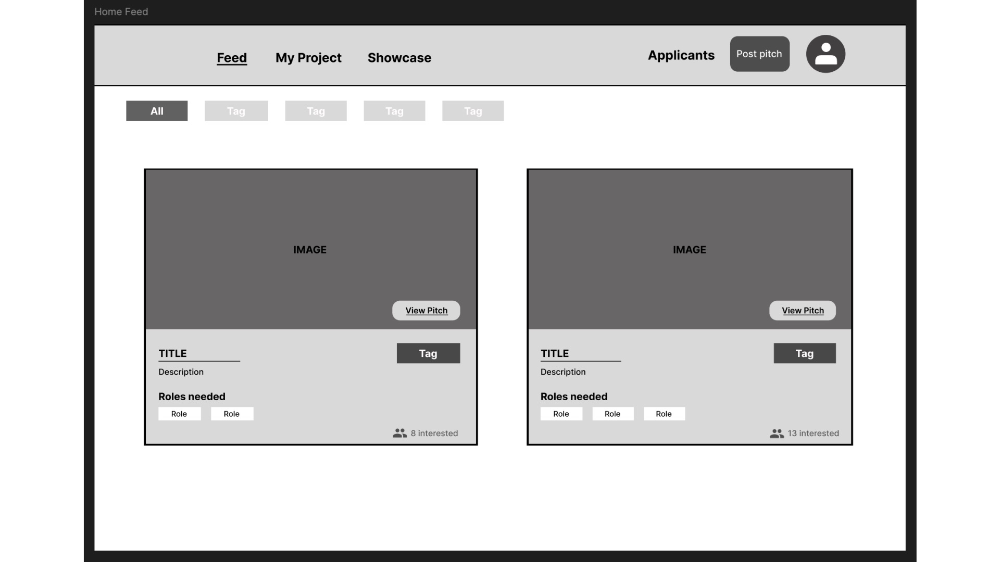
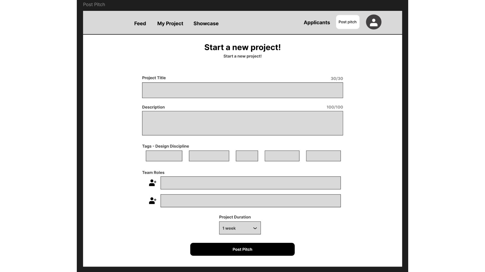
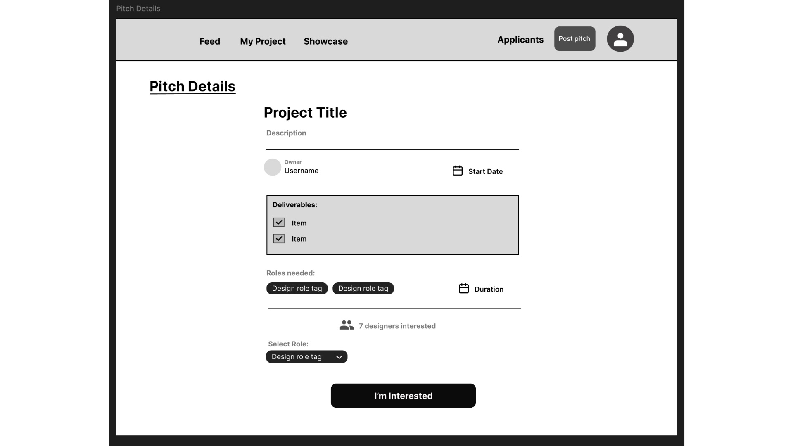
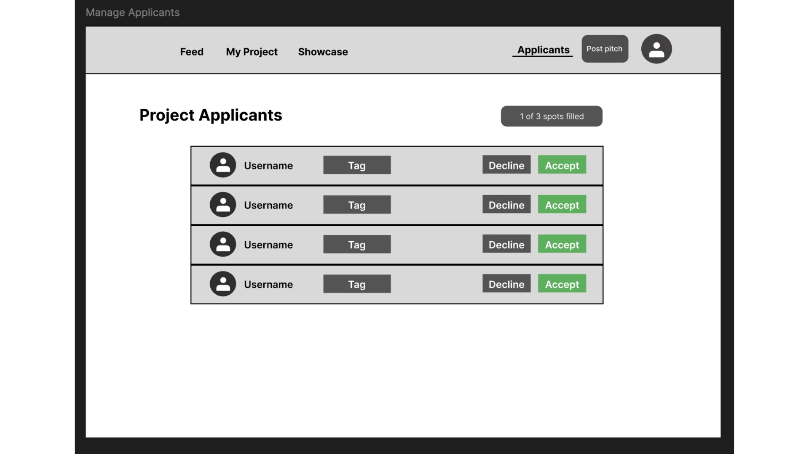
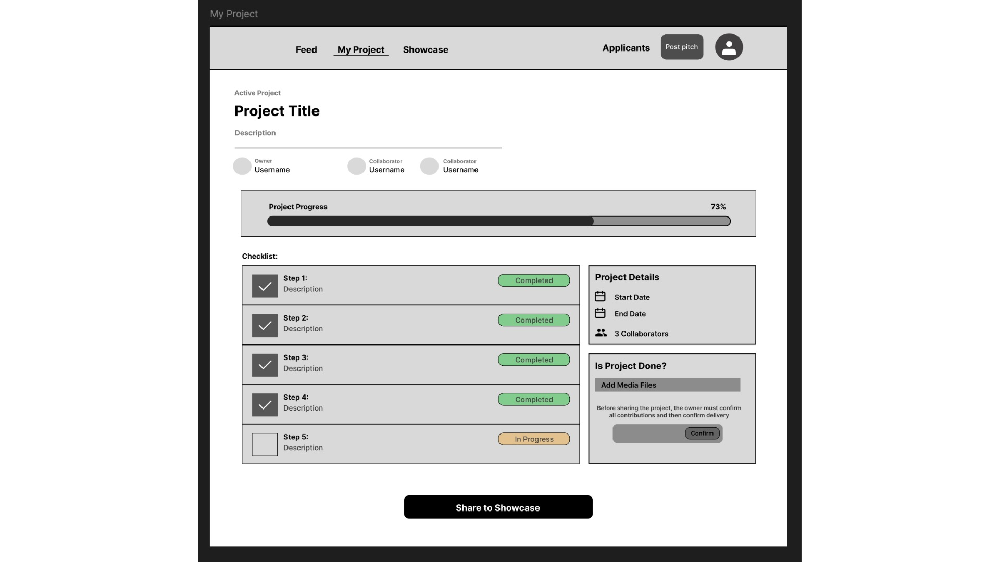
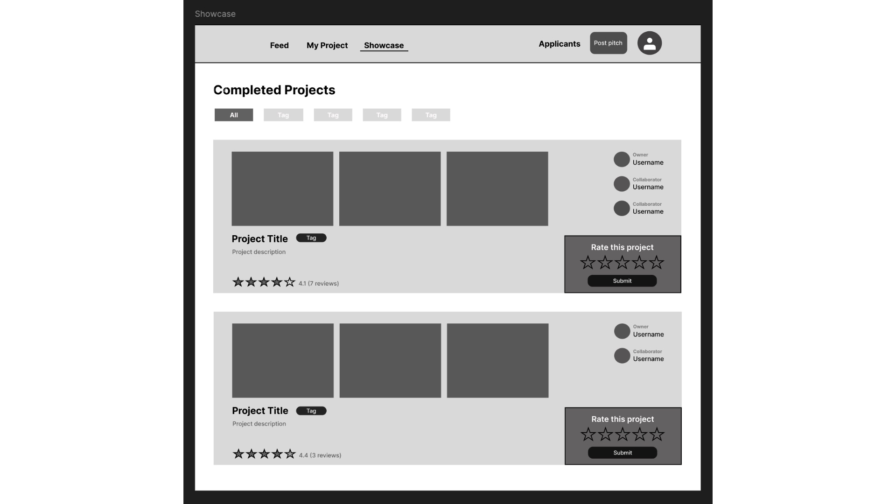
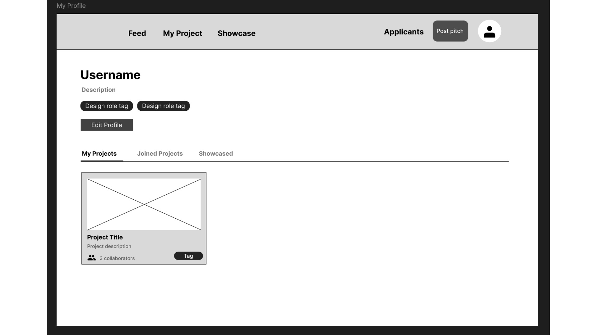

# My fourth blog - Visualising our layout with wireframes

Before coding, we started making wireframes to begin our journey. I made wireframes for each of the pages and then compared them as a group to have a broad idea of user flow and the platform as a whole. 

## Home/Feed 
This is our landing page. It features a two-card grid that displays with the pitch, a cover image, title, description, required roles, category tag and interest count. A horizontal tag filter at the top uses database query filtering by the discipline of design. The interest count is a way to create engagement and display how competitive a pitch is.

 

## Post a pitch Page
A form to post your pitch. There is space for the title and description, tags for the discipline, roles for the team, and it’s linked to the pitch ID and a pre-determined duration to help users have a set deadline to make it manageable. 

 

## Pitch details Page
Shows everything a potential collaborator needs like deliverables, checklist, durations, description, roles, and role selector before applying. The checklists set expectations upfront, reducing misaligned collaborations. “I’m interested” writes a new applicant record linked to the selected role. 

 

## Manage applicants Page
Owner-only view. A list with accept and decline per applicant. A spot for the amount of roles available and what positions are filled will be pulled by the ID from the databases. Accepting an applicant updates their status and could trigger a notification for the accepted applicants. 

 

## My Project / Checklist Page
A progress bar calculates automatically from the checklist completion percentage. All the collaborators, project details panel to reflect the progress, checklist for all the steps that need to be done before the submission and whether it's completed or not. In the final stretch of the project, there is an option of adding media files and the owner of the project approving it to streamline the process. 

 

## Showcase Page
The project is displayed to the public and a link can be provided in the description if it's posted on personal portfolios. Three image gallery, collaborator names, a star review left by members of the community to display their thoughts. The rating system displays accountability on project quality and helps future collaborators evaluate their teams and this would be averaged on backend updates in real time. 

 

## User Profile 
The profile displays username, bio and role tags at the top. Three tabs to depict what the user has done on the platform - my projects joined projects, showcased by each pulling from a different database query. The same component from the feed is reused, keeping the component library simple. 

 

## User flow: 
Browse feed -> view pitch -> apply -> get accepted -> collaborate on checklist -> complete the project -> showcase -> build profile. Users either get to create projects or be the collaborator. 

The next blog will focus on the creation of the databse tables, their relationship and how their interactions work. 
