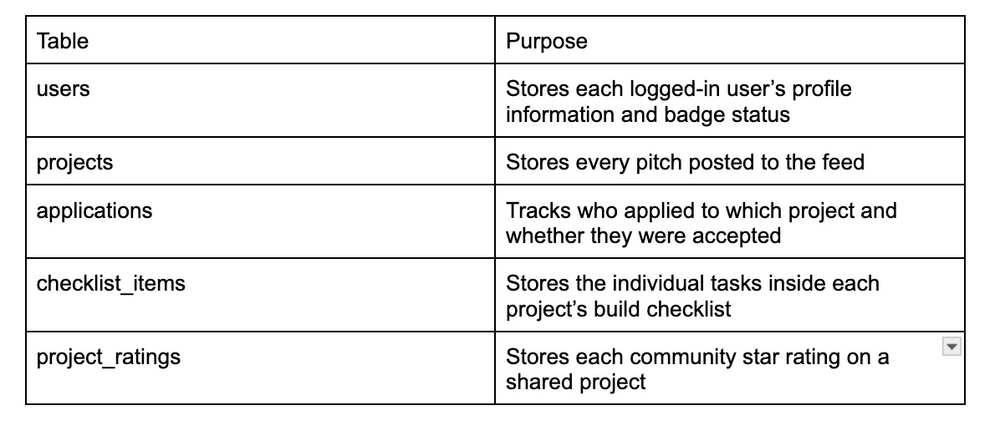
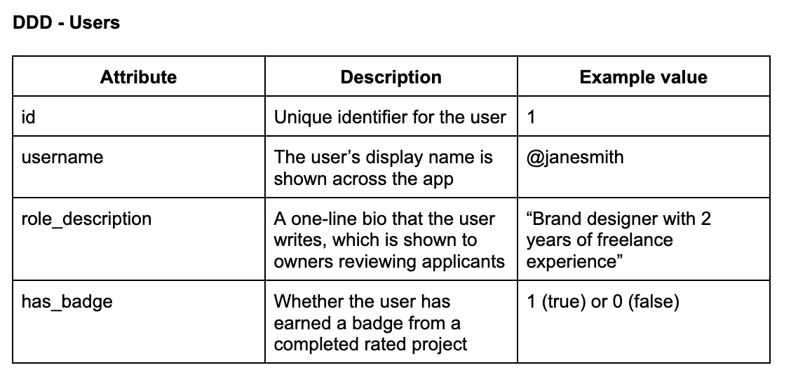
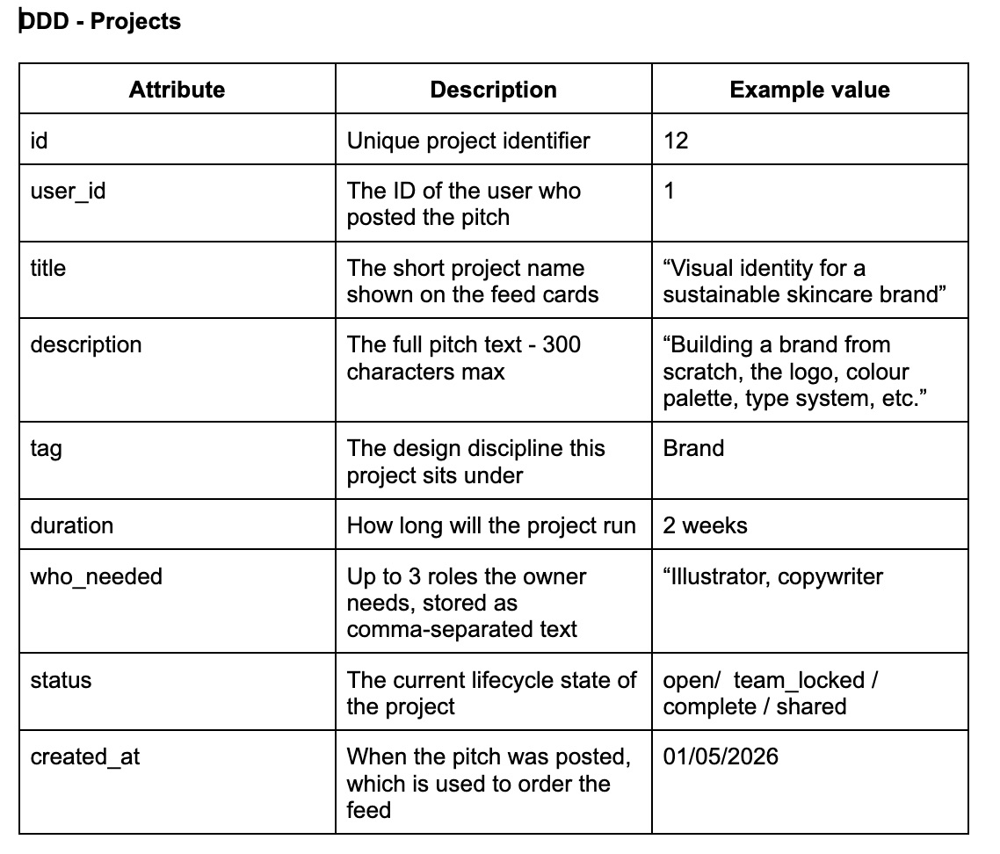
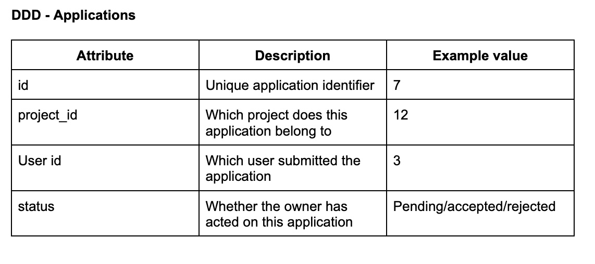
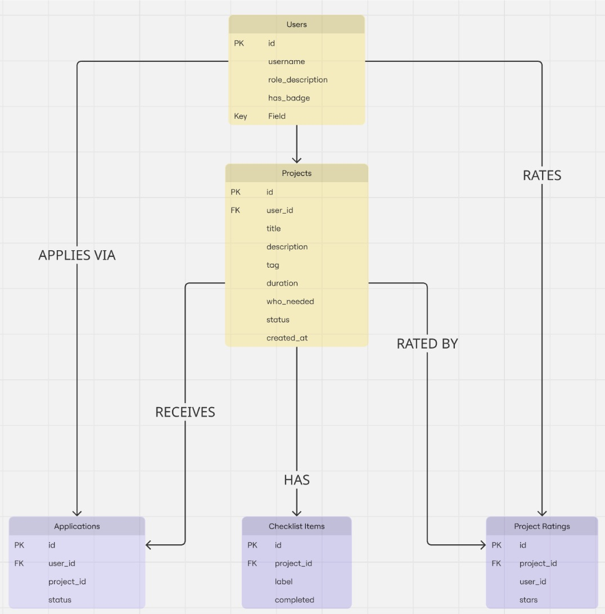

# My fifth blog - Creating ERD, DDD and how it connects to our app 

This is the list of tables in our SQLite database and what each table is responsible for: 

  

The database is built around five tables that each serve a distinct role in the project lifecycle. The users table sits at the centre while all the other tables reference it through the foreign key. It will be used for project owner, applicant, or when someone leaves a rating. 
The projects table will be the most complex table because they will carry most of the website's content like the pitch pages, on the user profile and the showcase page. The applications table acts as the foundation of the team formation record. The checklist_items and project_ratings table are lean and simple structures that keep the progress bar calculations in check and help with the badges concept. They will help us with fast and reliable logic triggering on every interaction. 

## The DDD tables: 

### DDD - Users 

Every page reads from this table like the nav bar, pitch cards, applicant lists, and badge display all depend on it. What stood out when mapping this was how little we need to store for the users. BlaBla Corp will be handling the authentication, hence no password management. The only user data that matters to our concept is the editable role description and the badge. 

### DDD - Project 

This is the heaviest table in our schema and it is the one that connects back to every other table. The status column controls access across all seven pages, what buttons render, which routes respond and what each user can see and storing this as one column was a decision to avoid conflicting states. One concern is who_needed as a string, aiming to be simple for now but could cause problems if we expand our scope. 

### DDD - Applications

This table is focusing on many-to-many connections between users and projects, the team member record and the access control list for the owner version of the build page.
Before rending, we aim for the Mojo.js queries this table to confirm the session user belongs. If any access control issues arise, this will be our first table to check. 

### DDD - Checklist Items 

The simplest table in our schema focuses on one row per task and one boolean for completion to help us make the progress bar. It will help calculate a single COUNT query rather than storing a pre-calculated percentage. This ensures the bar is always accurate.  

(table)

### DDD - Project Ratings 

After every INSERT, we aim for Mojo.js to run average stars for the project, if it hits three or above then, has_badge is set to 1 for the project owner and all the collaborators. To enforce a constraint on the server-side by checking for an existing row before inserting. 

(table)

## Entity Relationship Diagram: 

 

We designed the diagram and the table's relationship together as a group.  

### Relationships: 

- USERS to PROJECTS - One user can post many projects, but each project has one owner. 

- USERS to APPLICATIONS - One user can apply to many projects.

- USERS to PROJECT_RATINGS - One user can rate many projects, but only one rating per project. 

- PROJECTS to APPLICATIONS - One project recieves many applications 

- PROJECTS to CHECKLIST_ITEMS - One project has up to 5 checklist items. 

- PROJECT to PROJECT_RATINGS - One project can receive many ratings from the community. 

One project can have one owner but one or many collaborators. One owner can zero or many projects. 

## Interactive Elements - Risks, Accessbility and Scope

The highest risk for interactions are the checklist tick, star rating and apply button as they will trigger a server-side check, database write and then a HTMX swap simultaneously. 

They will require aria-labels for screen reader support and meet AA requirements. 

These are non-negotiable interactions and the core loop will not function without them. 

## Next Steps: 
I will focus on displaying our intial HTML static pages, plan out our user testing experience and our plan for the last few days before the website submission. 

