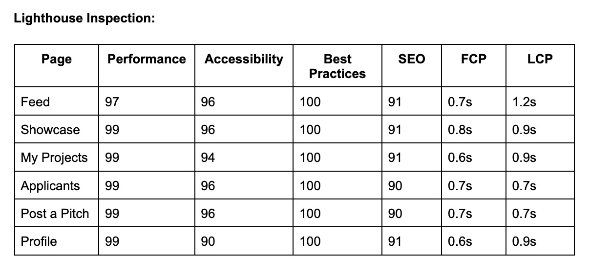
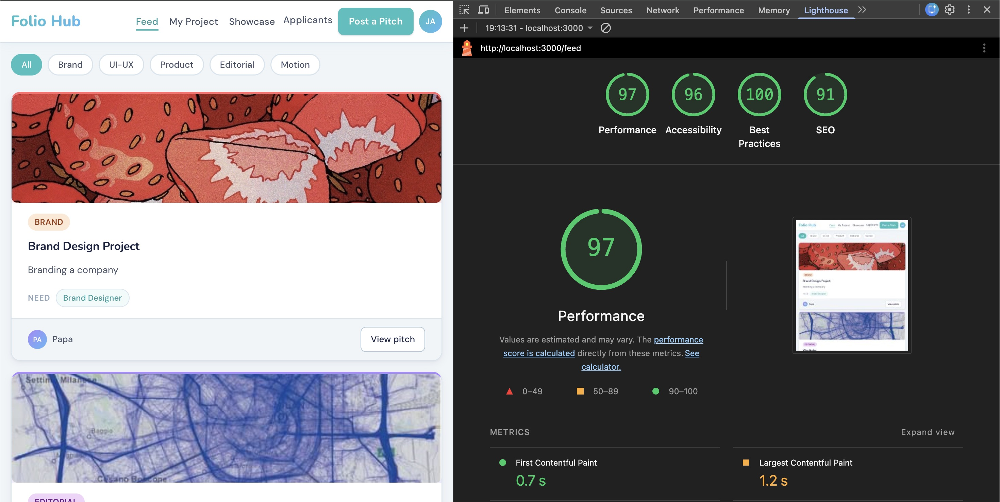
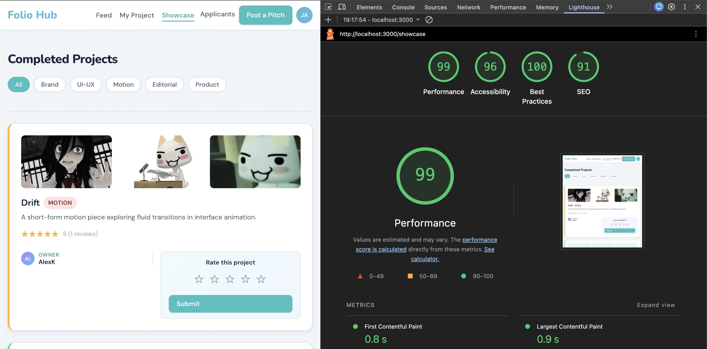
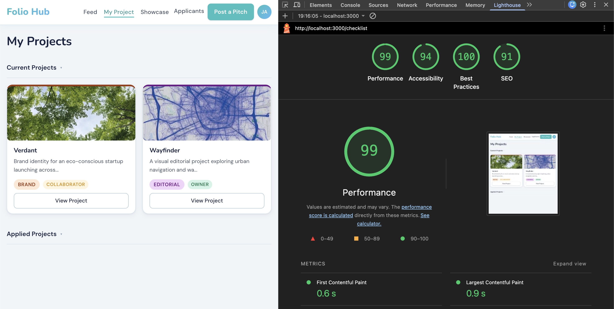
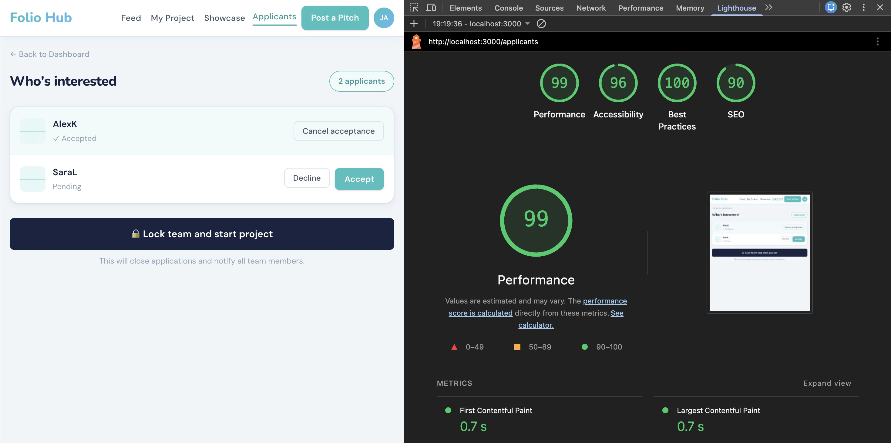
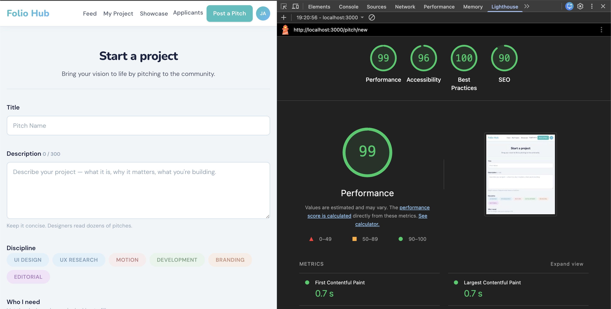
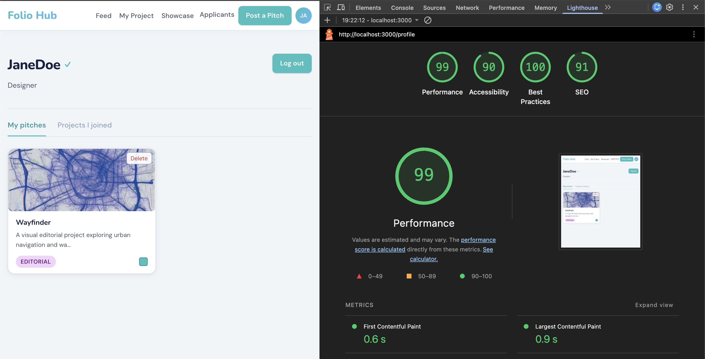
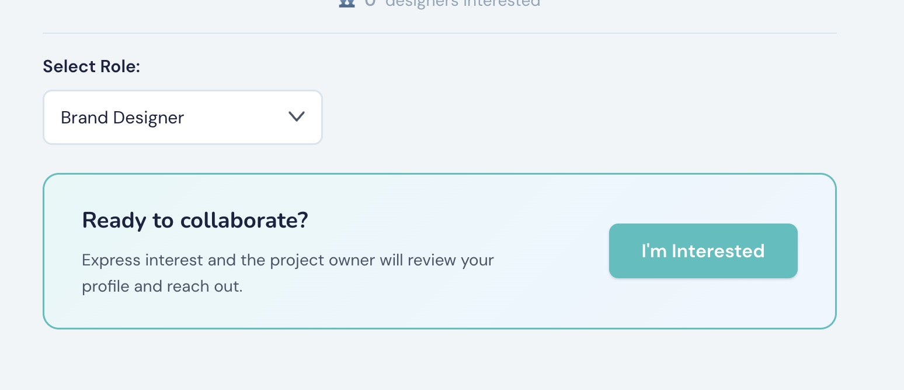
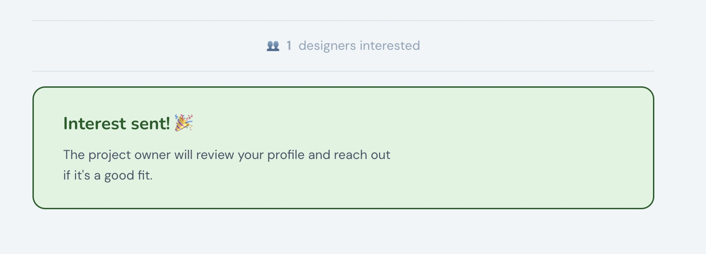
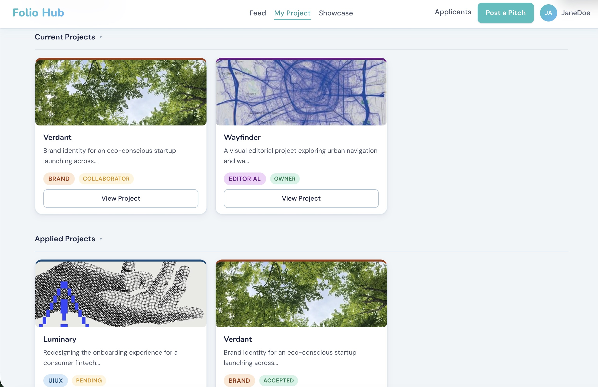

# Performance Evaluation 

Reflecting on our development and ideation process, the technically challenging moment was the image upload bug. The goal was straightforward: to store an uploaded image against a project and serve it back on the feed and pitch details page. The root cause was the MojoJS constraint with saveFile(), and ctx.params() both consume the HTTP request, so calling them in the wrong order dropped either the file or the form field with no error displayed, but the form was infinitely loading. Instead of rebuilding the system, my tutor explained to borrow from what the demo in BlaBla Corp offered, calling saveFile() before ctx.params(), which helped resolve the issue. 

Another issue was that the fresh installations of the app would crash on the feed page with feedback like “no such table: projects: because the user table was auto-created, but all the other tables existed if  schema.sql was run manually. This wasn’t documented in the readme, so teammates couldn’t run the app without deciphering the error message themselves. This gap caused some confusion but helped us develop a thorough readme file for the submission. 

## Lighthouse Inspection 

 

Performance scores ranged from 97 to 99 with our FCP and LCP within the brief’s 3-second maximum. The Feed page scored slightly lower at 97 with an LCP of 1.2s, the highest across all pages, because it loads user-uploaded cover images. Lighthouse flagged up to 651KKiB of potential savings on the Feed page alone as a consequence of not processing images at upload time. By contrast, Applicants and Post a Pitch both scored 99 with an LCP of 0.7s, as neither page loads user images dynamically. Render-blocking requests(~490-730ms) appear consistently across all six pages, pointing towards the CSS stylesheet loading synchronously as a site-wide issue. 

### Feed - Lighthouse Inspection

 

### Showcase - Lighthouse Inspection

 

### My Projects - Lighthouse Inspection

 

### Applicants - Lighthouse Inspection

 

### Post A Pitch - Lighthouse Inspection

 

### Profile - Lighthouse Inspection

 

# User Experience and Accessibility

## User Experience (The Flow & Interactions)

The initial project focused on creating only one user flow path of being the owner of a project, but when we tested with multiple accounts, it became clear that the collaborator experience was entirely unaccounted for.  A collaborator viewing the checklist would see the same controls as an owner, including the publish button. Fixing this required substantial rework across the checklist controller, My Projects page and Applicants page to include an isOwner flag pressed through all the relevant templates. This was done to support both roles by giving users the flexibility to decide what they choose to do with Folio Hub.

Two smaller interactions that improved usability were: the “Interest sent” confirmation was added after applying, as the previous iteration had the user clicking the button with no feedback, and the button remained, which confused users. The HTMX state change gives the user clear confirmation without a page reload. Similarly, the published project lock was created to place all completed projects in a showcase to prevent a confusing state where users could continue editing something already public. 

The Current/Applied Projects dropdown on the My Projects page used to only display the user’s project, which was exactly what the profile page did. Instead, we made it display various active projects, what projects they are currently a part of and what they have applied to. This gave them the ability to view projects that they applied to, the status and the pitch.

### I'm Interested Button / Feature

 

 

## Accessibility (Lighthouse & WAVE)

Our project has scored an average of around 95 on our accessibility scores, with the lowest being 90 on the profile page due to the tab panel switching using JavaScript, not including proper aria attributes - aria-selected and aria-controls. 100 on Best Practices across all pages. 

The main issue is contrast errors throughout the project due to the muted secondary colour, where the buttons or the tags are said to be low contrast and are at risk of falling below the WCAG AA guidelines. This design choice was done to create a muted tone for the secondary text. Using a darker text colour would help resolve this issue while still following the colour theme. All images have alt text with aria labels to ensure an accessible application. 

For future development, adding full keyboard navigation would be a meaningful accessibility improvement beyond what was implemented. 

## Usability gaps

There is no pop-up notification when a pitch is posted, nor is any notification received when a user is selected for a project. This was an aspect overlooked while creating the project. These are small details to consider, but they could have made a difference in the user experience. We realised this when a teammate tested the app for the first time. They applied to a project and assumed it didn’t work because there was no feedback on the screen. 

Forms also have no inline validation, as a failed submission produces a server error rather than field-level feedback. These were features missed during the development, but gaps were found during testing and work as a reminder of the importance of user testing. 

# Functional Requirement 

The core feature loop was shipped as intended - pitch posting, applying to projects, accepting and declining applicants, checklist progress tracking, multi-image upload, showcase page with star ratings and session-based authentication. The project status flow goes - open → completed → published; the owner/collaborator distinction is fully functional across all relevant pages. 

Two areas grew beyond the original scope. 
The multi-userflow was the most underestimated as it initially seemed like a minor addition that revealed collaborators would need a different view of the checklist, project picker, publishing restrictions and required significant rework across multiple controllers and src.
My Projects page was significantly updated to provide a richer experience to both the owner and collaborators. Instead of adding a new page for notifications and a new schema table, we changed the way My Project displayed the projects the user is part of. 

### Improved MyProject Page

 

The badge feature was not shipped due to a few reasons. The main idea was to award designers recognition based on their ratings on completed projects in the showcase. We didn’t design the database to support this during the planning stage. We would have had to create a badge table and a user_achievement table, and adding them in later stages of development would have meant redesigning our ERD and DDD, and we wouldn’t have been able to test the feature out in the remaining time. Has_badge is a part of Project Ratings in our DDD table, but we ultimately decided to cut this aspect. This is something I’d approach differently next time: features driven by derived logic to be planned and constructed from the start. 

# Lessons Learned

The biggest takeaway from this project is that planning the database is as important as the user flow and usability during the early stages. This project has taught me the importance of understanding databases as a fundamental in web application development. The badge system did appear in our early DDD planning with has_badge, but the implementation was never actually added to the final schema. 

Testing with multiple user accounts in the early stages would have surfaced all the collaborator flow issues sooner. These problems only became visible when two users tried to interact with the same project. 

This assignment also taught me a more hands-on understanding of login sessions, the utilisation of encrypted cookies with MojoJS, the ethics of user data in web applications and how data is managed on the server-side. 

